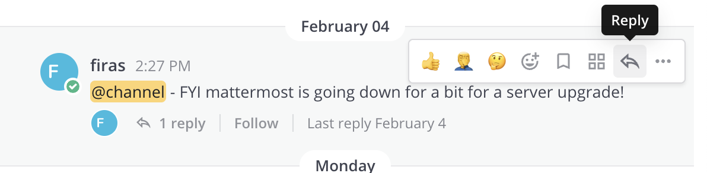

(page_install_ds_stack_macOS)=
macOS Software Stack
=======================

<!-- <!-- <head>
	<base target="_blank">
</head> -->

```{tip}
Before starting, I suggest updating your Mac to the latest version your laptop can run:


```

These instructions will walk you through installing the required Data Science software stack for this project. 
Before starting, ensure that your laptop meets the minimum requirements listed [here](https://docs.docker.com/desktop/install/mac-install/).

If your computer does not meet any of the requirements above, let me know first and we can discuss alternate possibilities so you can still participate.

## Installation notes

Unless you really know what you are doing, if you have already installed Git, Conda, or any of the Python related packages below, I **strongly** advise you to please uninstall these and follow the instructions below to re-install and configure them correctly (make sure to also remove any user configuration files and backup them if desired).
In order to be able to support you effectively and minimize setup issues and software conflicts, we suggest students to install the software stack the same way (even though there are better ways).

In all the sections below, if you are presented with the choice to download either a 64-bit (also called x64) or a 32-bit (also called x86) version of the application **always** choose the 64-bit version.

Once you have completed these installation instructions, make sure to follow the post-installation notes at the end to check that all software is setup correctly.

## Table of Contents

- [Zoom](zoom)
- [Mattermost](mattermost)
- [GitHub.com account](github.com)
- [Terminal](terminal)
- [Command Line Tools](command-line-tools)
- [Python](python)
- [R](R)
- [Visual Studio Code](visual_studio_code)
- [Git and GitHub](git_github)
- [Tree](tree)
- [Test JupyterLab](test_jupyterlab)
- [Docker](docker)

(zoom)=
## Zoom

We will be using Zoom for this project for our meetings.
It is *very* important that you have the most recent version of Zoom installed, as we will be using many of the features that are only available in more recent versions.

The latest version of Zoom as of May 2023 is: `5.14.6 (17822)`.
You can ensure you have the latest version of Zoom by clicking "Check for Updates" as shown in the screenshot below.


```{important}
Please note that if you have been relying on the "web version" of Zoom that works only in a browser, this will not work for this project!
Please make sure to download the Zoom desktop client for your operating system to fully participate in the course.
```

(mattermost)=
## Mattermost

Once students have joined the team, for team communication and coordinating, we will be using Mattermost.
Mattermost is an open source tool that has functionality similar to enterprise tools such as Slack, Hipchat, Ryver, etc...

Once you have been accepted into the team, you will receive a URL (via email) you can use to join the Mattermost Team.
Click that link to accept the invitation, create an account, and download the desktop and mobile apps (https://mattermost.com/download/#mattermostApps) so you can stay connected to the projects.

You will need the following server information:

- Server URL: https://moosvilab.ok.ubc.ca
- Server Display Name: `MoosviLab`

### Tour of Mattermost

```{dropdown} Channels in Mattermost
    :class-container: sd-shadow-lg
    :color: primary
    :open:

<div class="container youtube">
<iframe class="responsive-iframe" src="https://www.youtube-nocookie.com/embed/zC3XRzeMMPs" frameborder="0" allow="accelerometer; autoplay="0"; encrypted-media; gyroscope; picture-in-picture" allowfullscreen></iframe>
</div>
```

```{dropdown} Mattermost Mobile
    :class-container: sd-shadow-lg
    :color: primary
    :open:

<div class="container youtube">
<iframe class="responsive-iframe" src="https://www.youtube-nocookie.com/embed/YPFfXISvydk" frameborder="0" allow="accelerometer; autoplay="0"; encrypted-media; gyroscope; picture-in-picture" allowfullscreen></iframe>
</div>
```

### Threads in Mattermost

In **most cases** you should be using Threads whenever you're replying to a message, that helps keep things organized.
When you want to start a new conversation, you can post a new message in the appropriate channel (avoid duplicate posting), and the expectation is others will respond to your message in threads.
Don't worry about posting too much or bothering others - this tool is only being used by our team!



### Your bio

Once you've gotten the hang of Mattermost by watching the videos above, you're ready to send your first message!
In the `oer-introductions` channel, upload a reasonably professional picture of yourself and a short (150-200 words) bio/paragraph that you are comfortable sharing publicly.
You can see the previous examples of former students there.
This will go up on the [project website here](https://firas.moosvi.com/oer/physics_bank/files/bio.html).
In addition to the bio, feel free to also say hi and chat with the other project team members on Mattermost!

(github.com)=
## GitHub.com account

Sign up for a free account at [GitHub.com](https://github.com/) if you don't have one already.
Your GitHub username is important, here's how to find your username:


(terminal)=
## Terminal

The **command line** (also known as the Terminal) is the text interface to the computer that accepts commands that the computer will execute.
These commands include:

- starting programs
- navigating directories and manipulating files 
- searching, sorting, and editing text files 
- system and environment configuration

Apple recently changed the Mac default shell in the Terminal to Zsh - though the [reasons for this](https://thenextweb.com/dd/2019/06/04/why-does-macos-catalina-use-zsh-instead-of-bash-licensing/) are complicated, it is a huge improvement over the out-dated Bash version that came pre-installed on macOS.

If you are already on macOS Ventura (13.3), Monterey (macOS 12.5), or Big Sur (macOS 11.x), this change is already made for you. 
But if you are on Catalina (macOS 10.x), you will need to switch your shell. 

To check which shell you are running, open a new Terminal (`Applications-->Utilities-->Terminal` or activate Spotlight and type in Terminal).
You will see a new window pop up and a blinking cursor.
Type in the following command:

```
echo $0
```

If you are running a `bash` shell, you will see the output as `bash`.
If you are running a `zsh` shell, you will see the output as `-zsh`.

### Change your default shell to `zsh` (if necessary)

To make sure your shell is set to zsh, run this command:

```
chsh -s $(which zsh)
```
You may be prompted for your macOS administrative user password.
Enter the password, quit the terminal (`File-->Quit` or `Command+Q`), and open it up again.

You should now proceed to do some more configuration via the Terminal.

### Install Ohmyzsh to get Terminal colours, and highlighting

Install `Ohmyzsh` to add Terminal colours, highlighting and other cool features.

Oh My Zsh is installed by running the following command in your Terminal: 

```
sh -c "$(curl -fsSL https://raw.githubusercontent.com/ohmyzsh/ohmyzsh/master/tools/install.sh)"
```

You may now customize your Terminal with themes (see [screenshots of themes here](https://github.com/ohmyzsh/ohmyzsh/wiki/Themes)) by [following the directions here](https://github.com/ohmyzsh/ohmyzsh#selecting-a-theme).
Selecting a theme is optional, the default one is pretty good as it is!

(command-line-tools)=
## Install Command-line Tools

Now we are ready to install some command-line tools via the Terminal.
Open a Terminal and type the following command to install Xcode command line tools:

```
xcode-select --install
```

```{tip}
In the past, this step has caused students some issues due to a variety of reasons.
Please **ask for help** if you run into any issues!
You're welcome to try and troubleshoot it yourself, but if you get stuck for too long, reach out to me and I can probably help you fix it fairly quickly.
Common issues include: not enough disk space, not having the latest version of your operating system installed, network issues, corrupted download, etc...
```

This is a fairly large download and make take a few minutes to install.
You may also need to restart your machine.

(python)=
## Python

We will be using Python for a large part of this project, and `conda` will be our main Python package manager.
We will be using the [Miniconda installer (read more here)](https://docs.conda.io/en/latest/miniconda.html) to install python.
The Miniconda installer also provides us with a minimum number of useful packages so installation is quick, and relatively painless.

### Installing python

The latest Miniconda installer can be downloaded from here: [Miniconda macOSX 64-bit pkg install](https://repo.anaconda.com/miniconda/Miniconda3-latest-MacOSX-x86_64.pkg).

After installation, restart the terminal. If the installation was successful, you will see `(base)` prepending to your prompt string.
To confirm that `conda` is working, you can ask it which version was installed:
```
conda --version
```
which should return something like this:

```
conda 4.12.0
```

```{note}
Note: If you see `zsh: command not found: conda`, try the following>: Open a new Terminal (it should be zsh), then type: `source /Users/YOURUSERNAME/miniconda3/bin/activate` OR `source ~/miniconda3/bin/activate` depending on whether you installed for all users, or just your user (make sure to also change YOURUSERNAME to your username). Then enter the following command `conda init zsh`. The error should now be fixed.
```

Next, type the following to ask for the version of Python:
```
python --version
```
which should return something like this:

```
Python 3.9.10
```

```{note}
Note: If instead you see `Python 2.7.X` you installed the wrong version. Uninstall the Miniconda you just installed (which usually lives in the `/opt` directory), and try the installation again, selecting **Python 3.9** (or higher).
```

### Essential Python packages

`conda` installs Python packages from different online repositories which are called "channels".
A package needs to go through thorough testing before it is included in the default channel, which is good for stability, but also means that new versions will be delayed and fewer packages are available overall.
There is a community-driven effort called the [conda-forge (read more here)](https://conda-forge.org/), which provides more up-to-date packages.
To enable us to access the most recent versions of the Python packages we are going to use, we will add this channel.
To add the conda-forge channel type the following in a Terminal window:

```
conda config --add channels conda-forge
```

To install packages individually, we need to use the following command: `conda install -c conda-forge "<package-name>"`.
The part about `conda install` tells the `conda` package manager to install a particular package, and the `-c` part is an extra "option" that tells `conda` to look in the `conda-forge` channel (which usually has the latest updated packages).
Let's install the key packages needed (you will note that we're also specifying certain versions of the package with `= X.Y`).
You should copy and paste each line below in your Terminal to install the following packages:

```
conda install -c conda-forge black
conda install -c conda-forge nbconvert
conda install -c conda-forge seaborn
conda install -c conda-forge pandas
conda install -c conda-forge numpy
conda install -c conda-forge jupyterlab
conda install -c conda-forge pre-commit
```

`conda` will show you the packages that will be downloaded, and you may need to press `enter` or `Y` (for yes) to proceed with the installation.
This may take a while to complete.

### Packages not yet available on `conda`

There are some packages that we need for this project that are not available on the `conda` package manager, so let's use `pip` to install them:

```
pip install problem_bank_scripts --upgrade
pip install problem_bank_helpers --upgrade
```

(R)=
## R, IRkernel, and RStudio

R is another programming language that we will be using a lot in this project, particularly for the Data Science and Statistics problem banks.
We will use R both in Jupyter notebooks and in RStudio.

### Installing R

To download the latest version of R, [visit this website](https://cran.r-project.org/bin/macosx/) and select the Apple Silicon for a newer Mac with an M1/M2 chip, or the Intel chip version
Open the file and follow the installer instructions accepting the default configuration.

<!-- After the installation is complete, we will add the R executables to the PATH variable in terminal so that you can use it without typing the full path to R each time. Open a terminal and type:

```
code ~/.bash_profile
```

Append the following line to the file

```
# Add R and Rscript to PATH
export PATH="/c/Program Files/R/R-4.0.2/bin/x64":$PATH
```

Then save the file and exit VS Code. -->
Once it's installed, you can open a Terminal and type,

```
R --version
```

and that should return something like:

```
R version 4.2.3 (2023-03-15) -- "Shortstop Beagle"
Copyright (C) 2023 The R Foundation for Statistical Computing
Platform: aarch64-apple-darwin22.3.0 (64-bit)

R is free software and comes with ABSOLUTELY NO WARRANTY.
You are welcome to redistribute it under the terms of the
GNU General Public License versions 2 or 3.
For more information about these matters see
https://www.gnu.org/licenses/.
```

> Note: Although it is possible to install R through Anaconda, we highly recommend not doing so. In case you have already installed R using Anaconda you can remove it by executing `conda uninstall r-base`.

### RStudio

[Download the macOS version of RStudio](https://posit.co/download/rstudio-desktop/).
Open the file and follow the installer instructions.

To see if you were successful, try opening RStudio by clicking on its icon. It should open and looks something like this picture below:


<!-- Next, we will make sure that Rstudio uses the same directories as R from terminal for its configuration. To do this, we will need to set an environmental variable in Windows. First, open the start menu, type "env" and select the match that reads "Edit the system environment variables". Click the button at the bottom that reads "Environmental Variables...":


Under "User variable" click the "New..." button:


And type in `R_USER` as the "Variable name" and `C:\Users\username` as the "Variable value", replacing `username` with your actual user name (if you don't know your user name, look at the top of the screenshot above where it says "User variables for your_username"):


Click "OK" on all of the three windows we opened above and you're done! If you open RStudio and R from terminal and type

```
.libPaths()
```

both should return the same values, e.g.

```
"C:/Users/joelo/R/win-library/4.0"   "C:/Program Files/R/R-4.0.2/library"
```

### Rtools

Windows users will also need to install Rtools, which will allow you to use external libraries. Go to <http://cran.r-project.org/bin/windows/Rtools/> and download the latest version (e.g., Rtools40.exe). After the download has finished, run the installer with the default configuration. Do *not* follow the Rtools' website instructions for "Putting Rtools on the PATH". RStudio will put Rtools on the PATH automatically when it is needed.

To test if you're installation was successful, open RStudio and type the following into the Console:

```
install.packages("jsonlite", type = "source")
```

If the `jsonlite` package installs without errors, Rtools is setup correctly. -->

### Essential R packages

Next, install the key R packages needed for the start of MDS program,
by opening up RStudio and
typing the following into the R console inside RStudio:

```
install.packages(c('tidyverse', 'blogdown', 'xaringan', 'renv', 'devtools', 'usethis'))
```

If you get a prompt asking if you want to install packages that need compilation from sources, click "Yes".

> Note: we will use many more packages than those listed above across the MDS program, however we will manage these using the `renv` package manager (which you will learn about in DSCI 521: Platforms for Data Science).

### IRkernel

The `IRkernel` package is needed to make R work in Jupyter notebooks. To enable this kernel in the notebooks, open R *from a Terminal* and run the setup via the following two commands:

```
install.packages('IRkernel')
IRkernel::installspec()
```

When asked to select a mirror, pick one at a location close to where you live for faster downloads.

> Note that you cannot use RStudio for this step because it will not be able to find the jupyter installation. R from terminal will since the correct PATH for jupyter is set when the terminal is launched.

To see if you were successful, try running JupyterLab and check if you have a working R kernel. To launch the JupyterLab type the following in the terminal:

```
jupyter lab
```

A browser should have launched and you should see a page that looks like the screenshot below. Now click on "R" notebook (circled in red on the screenshot below) to launch an JupyterLab with an R kernel.


Sometimes a kernel loads, but doesn't work as expected. To test whether your installation was done correctly now type `library(tidyverse)` in the code cell and click on the run button to run the cell.
If your R kernel works you should see something like the image below:


To improve the experience of using R in JupyterLab, we will add an extension that allows us to setup keyboard shortcuts for inserting text (thanks to former MDS student Ryan Homer for developing this extension!).
By default, it creates shortcuts for inserting two of the most common R operators: `<-` and `%>%`.
Run the following from terminal to install the extension:

```
jupyter labextension install @techrah/text-shortcuts
jupyter lab build
```

(visual_studio_code)=
## Visual Studio Code

The open-source text editor Visual Studio Code (VS Code) is both a powerful text editor and a full-blown Python IDE, which we will use for more complex analysis.
You can download and install the macOS version of VS Code from the VS code website [https://code.visualstudio.com/download](https://code.visualstudio.com/download).
Once the download is finished, click "Open with Archive utility", and move the extracted VS Code application from "Downloads" to "Applications".
Make sure you are able to open VS Code by clicking on the application.

### VS Code extensions

The real magic of VS Code is in the extensions that let you add languages, debuggers, and tools to your installation to support your specific workflow. Now that we have installed all our other Data Science tools, we can install the VS Code extensions that work really well with them. From within VS Code you can open up the [Extension Marketplace (read more here)](https://code.visualstudio.com/docs/editor/extension-gallery) to browse and install extensions by clicking on the Extensions icon in the Activity Bar indicated in the figure below.


To install an extension, you simply search for it in the search bar, click the extension you want, and then click "Install". There are extensions available to make almost any workflow or task you are interested in more efficient! Here we are interested in setting up VS Code as a Python IDE. To do this, search for and install the following extensions:

- `Python` (by Microsoft)
- `Path Intellisense` (by Christian Kohler)
- `EditorConfig for VS Code` (by editorconfig.org)
- `Code Spell Checker` (by Street Side Software)
- `indent-rainbow` (by oderwar)
- `isort` (by Microsoft)


[This video tutorial](https://www.youtube.com/watch?v=06I63_p-2A4) is an excellent introduction to using VS Code in Python.

### Configure VS Code to launch from the Terminal

1. Launch VS Code.
2. Open the Command Palette (⇧⌘P ; Shift+Command+P).
3. Type 'shell command' to find the "Shell Command: Install 'code' command in PATH" command.
4. Hit Enter
5. Restart the Terminal for the new $PATH value to take effect. 

You can open files in VS Code from the Terminal!
Alternatively, just type `code .` in any folder to start editing files in that folder.

You can test that VS Code is installed and can be opened from Terminal by restarting Terminal and typing the following command in a Terminal:

```
code --version
```

you should see something like this if you were successful:

```
1.78.2
b3e4e68a0bc097f0ae7907b217c1119af9e03435
arm64 (or x64)
```

````{tip}
If the Shell command doesn't work for you, then you may try running this command in a Terminal to manually add VS Code to your path:
```
cat << EOF >> ~/.zprofile
# Add Visual Studio Code (code)
export PATH="\$PATH:/Applications/Visual Studio Code.app/Contents/Resources/app/bin"
EOF
```
````

### Setting VS Code as the default editor

To make programs run from the Terminal (such as `git`) use VS Code by default, we will modify `~/.z_profile`. First, open it using VS Code:

```
code ~/.z_profile
```

```{note}
If you see any existing lines in your `~/.z_profile` related to a previous Python installation, please remove these.
```

Paste the following lines to the new file that opens up:

```
# Set the default editor for programs launch from Terminal
EDITOR="code --wait"
VISUAL=$EDITOR  # Use the same value as for "EDITOR" in the line above
```

Then save the file and exit VS Code.

> Most Terminal programs will read the `EDITOR` environmental variable when determining which editor to use, but some read `VISUAL`, so we're setting both to the same value.


(git_github)=
## Git and GitHub

We will use the publicly available [GitHub.com](https://github.com/) as our versioning system.

You should already have your GitHub.com username, you will need that for this section.

### Install Git on your computer

We will be using the command line version of Git.
Some of the Git commands we will use are only available since Git 2.23, so if your Git is older than this version, we ask you to update it using the Xcode command line tools (not all of Xcode), which includes Git.

Open a Terminal and type the following to ask for the version:

```
git --version
```

you should see something like this (does not have to be the exact same version) if you were successful:

```
git version 2.40.0
```

```{note}
If you run into trouble, this is the time to post on Mattermost with your error message and ask for help!
```

### Configuring Git user info

Next, we need to configure Git by telling it your name and email.
To do this type the following into the Terminal (the same ones you used to sign up for GitHub) and assign your name and email to the git configuration files:

```
git config --global user.name "YOUR NAME HERE"
git config --global user.email YOUR@EMAIL.com
```

```{note}
To ensure that you haven't made a typo in any of the above, you can view your global Git configurations by either opening the configuration file in a text editor (e.g. via the command `code ~/.gitconfig`) or by typing `git config --list --global`.
```

### Create your GitHub "Personal Access Token"

This is a bit tricky, so please make sure you follow these directions carefully.

1. Create a **classic** Personal Access Token on GitHub.com by clicking this link: https://github.com/settings/tokens/new.

2. Add a short description (OPB project is probably fine).

3. Check the "repo" box and the "workflow" and the "admin" boxes.

4. Click "Generate Token" and make sure to COPY the token that they give you and save it somewhere secure (like a password manager), it is basically a special password that you can use in the Terminal. Save this token somewhere on your computer, you will need it when you clone a **private** repository to your computer.

```{tip}
Don't share your token with anyone and protect it like it's your password! 
You will not be able to come back to this page to get your token.
If you forget it, or lose it, you can just delete the token and create another one.
```

### Clone your first repository on your computer!

Open a Terminal window, and then run the following command:

```
git clone https://github.com/firasm/test.git
```

Hopefully, if things work, you should be able to see a new folder created at that location.
We will be talking more about what exactly you did over the next week and a bit, don't worry!

```{tip}
If after running the code above, you see the error message:

> fatal: destination path 'test' already exists and is not an empty directory. 

It means that you already attempted a clone before, and there is already a directory called `test` where you are trying to clone this repository.
You will first need to delete that directory to try again.

Open a Finder window on your computer, navigate to the directory, right click the `test` directory, and then delete the directory.
Alternatively, using the Terminal, you can remove the test directory:

> rm -rf test

which will "remove" the directory called "test". The "-" is to specify additional options: `r` means "recursively" for all the files in the directory, and `f` means "force" which means don't ask me for confirmation after deleting each file and folder.
```

(tree)=
## Tree

"Tree is a recursive directory listing program that produces a depth indented listing of files."
This is very useful to explore your directory and file structure to figure out which files are where.

You can install the `tree` package using this command:

`conda install -c conda-forge tree`

(test_jupyterlab)=
## Test JupyterLab

To test that your JupyterLab installation is functional, open a new Terminal window.
Then type `jupyter lab` and then hit enter.
This should open a new tab in your default browser with the JupyterLab interface.
To exit out of JupyterLab you can click `File -> Shutdown`,
or go to the terminal from which you launched JupyterLab and hold `Ctrl` while pressing `c` twice.

You should see something like this in your browser:


You're all done!

(docker)=
## Docker

You will also need to install Docker for this project.
It's free but you will need at least 25 GB of free space on your machine.

- On macOS [download it here](https://docs.docker.com/desktop/install/mac-install/)
    - Make sure to download the correct version - if you have a M1 or M2 Mac, you want the Apple Silicon, otherwise older Macs will have an Intel Chip.

To confirm Docker is working, open a Terminal and run the following:

```
docker --version
```

You should get an output similar to:

```
Docker version y.y.y, build yyyyy
```

We will configure Docker in a later section.

(attributions)=
## Attributions

* [Harvard CS109](http://cs109.github.io/2015/)
* [UBC STAT 545](http://stat545.com/packages01_system-prep.html#mac-os-system-prep) licensed under the [CC BY-NC 3.0](https://creativecommons.org/licenses/by-nc/3.0/legalcode).
* [Software Carpentry](https://software-carpentry.org/)

```{important}
These instructions have been heavily adapted and remixed from the original version provided by the UBC-Vancouver [MDS Install stack](https://ubc-mds.github.io/resources_pages/installation_instructions/) under a CC-BY-SA 4.0 license. They were originally written by [Anmol Jawandha](https://github.com/Anmol6) but have since been updated by Firas Moosvi, Joel Ostblom, Tomas Beuzen, Rodolfo Lourenzutti, & Tiffany Timbers, and others.
```